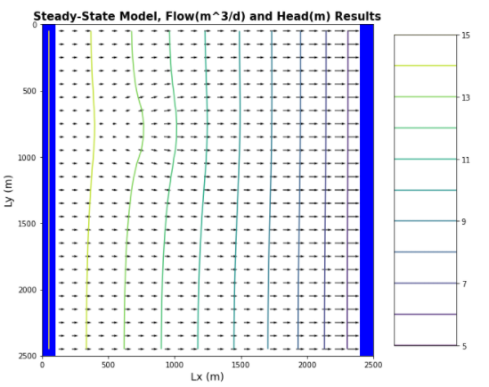
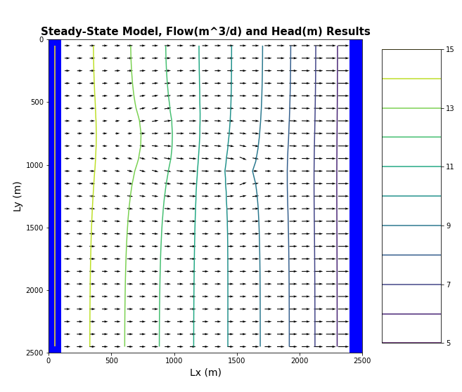

# HW 5 Recharge Me


### Dalia Portillo

The model that you have been provided is set up for a homogeneous medium. There is a well located at [0,10,15], but it is not being pumped. The recharge rate is zero. The left and right boundaries have constant heads of 20 and 10, respectively, and will be reduced to 15 and 5. 


#### Compare the head versus x distance - along a transect from the middle of one constant head boundary to the other - to the results for the BoxModel and explain any observed differences. The overall gradient is the same, as is the K of the medium ... is the flow the same for both boundary conditions? Why or why not?

<p float="left">
    
    <!---->
</p>

*Figure 1 Head transect along center column*


The gradients are the same ~0.004 m/m. Flow is now not the same. This is becasue of how MODLFOW models unconfined aquifers; each cell now is convertible cell and can change the saturated thickness. For example, if our saturated thickness, b, is 10 m and we adjust the heads to 15 and 5, then above b we’d get a linear relationship (representing the unsaturated zone) but a nonlinear relationship when the flow enters the new b. This is seen in figure 1 where the blue curve behaves differently after Lx = 2000. Because we changed the head distribution and in turn changed the saturated thickness, which changes T, the flux must respond to meet the head distribution by definition of type I boundary. Flow is greater toward the right boundary and relatively the same on the left.

#### Now add recharge at a constant rate of 1e-4 m/day over the entire top boundary. Explain the head transect and boundary flows. Is flow in this system 2D or 3D? Is it represented as 2D or 3D? Explain.

<p float="left">
  
  
  
</p>

*Figure 2 Head transect showing with uniform recharge over entire surface and no recharge*

*Figure 3 Flow vectors under recharge over the entire domain*

*Figure 4 Boundary flows and flow at center*

The head distribution produces a parabola looking figure starting and ending at 15 and 5, respectively. This illustrates ‘groundwater mounding’ where a shallower head gradient appears closer to the left boundary and steeper head gradient forms along the right boundary. The steeper gradient indicates an increase in flux across the boundary. 
Flow is now 2D because we have a horizontal and vertical component. It is not yet modeled as 3D since there isn’t a 3rd direction of motion (unless you count radial flow as a third direction).
In figure 4, we can see constant 1D flux along each boundary and in Figure 3, we can see the flow vectors in either direction horizontally while the head contours indicate vertical motion from the highest contour level.

#### Now model a system with zero recharge except for a farm located in [6:10, 6:10]. Recharge beneath the farm is 1e-4 m/day due to excess irrigation. First, calculate the annual excess irrigation, in meters, that has been applied to the farm. Second, assuming that the crop is cotton, it is located in southern Arizona, and cotton is grown all year (for simplicity), calculate the total irrigation rate on the farm that would be associated with this amount of excess irrigation. Finally, identify the area within the domain that might be subject to contamination if the recharge water was somehow tainted.

1.	Annual excess irrigation


```python
    A = 4*4 # m^2
    Re = 10**-4 # m/day
    d_yr = 365 # days/yr for 1 yr

    Excess = Re*d_yr
    print("Annual excess irrigation is estimated to be "+str(round(Excess,5))+" m")
```

    Annual excess irrigation is estimated to be 0.0365 m
    

2.	Total irrigastion = cotton demand + excess

Cotton is one of the thirstiest crops in existence, and uses approximately 5 vertical feet of flooded irrigation water per acre of cotton (in other words, 5 acre-feet).
It is estimated that 1 million acre-feet of water is used for cotton per year.


```python
cttn = 5             #acre-feet
acreft_m = 1234.48   #converts from acre-ft to cubic meters
ft_m = 3             #converts from ft to m

cttnDemand =(cttn*acreft_m/A)+Excess
print("The total irrigation is the sum of cotton water demand over this area plus the excess for recharge.")
print("Total irrigation is estimated to be " +str(round(cttnDemand,7))+" m")
```

    The total irrigation is the sum of cotton water demand over this area plus the excess for recharge.
    Total irrigation is estimated to be 385.8115 m
    

<p float="left">
  
  
</p>

*figure 5 Filled contour area of the recharge*

*Figure 6 Flow vectors indicating direction and relative change in speed*


3.	The recharge might be contaminated. Identify the area of potential contmaination.


The area with the smallest head values in Figure 5 (darkest shaded areas) are the area with most likely contamination. Becuse of dispersion and diffusion, any contamination might spread out first before moving along the direction of flow.

#### Lastly, start the well pumping at a rate of 8 m^3/day. Using one color, identify the capture zone of the well. Using a second color, show the area that might be contaminated by the irrigated farm fields. Comment on the impact of the well on the pattern of potential contamination.

<p float="left">
  <!---->
  
  
</p>

*Figure 7 Filled in drawdown contours with recharge and a well*

*Figure 8 Flow vectors with recharge and a pumping well*

Some of the contaminant will get drawn into the well while the rest will flow past the well.


```python

```
