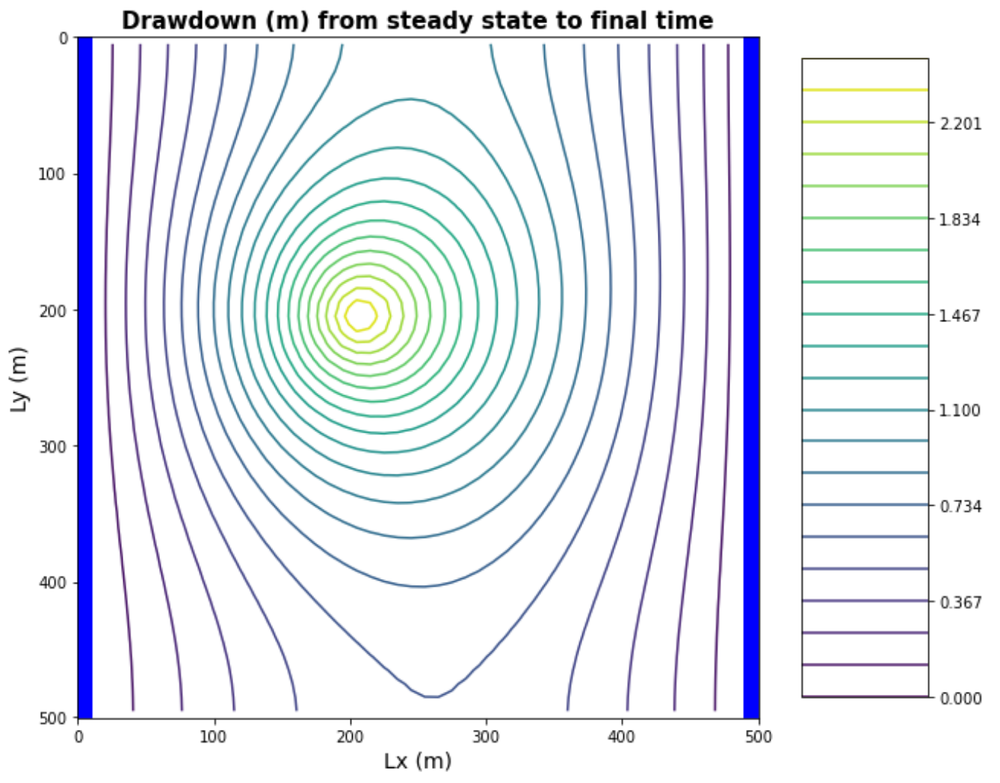
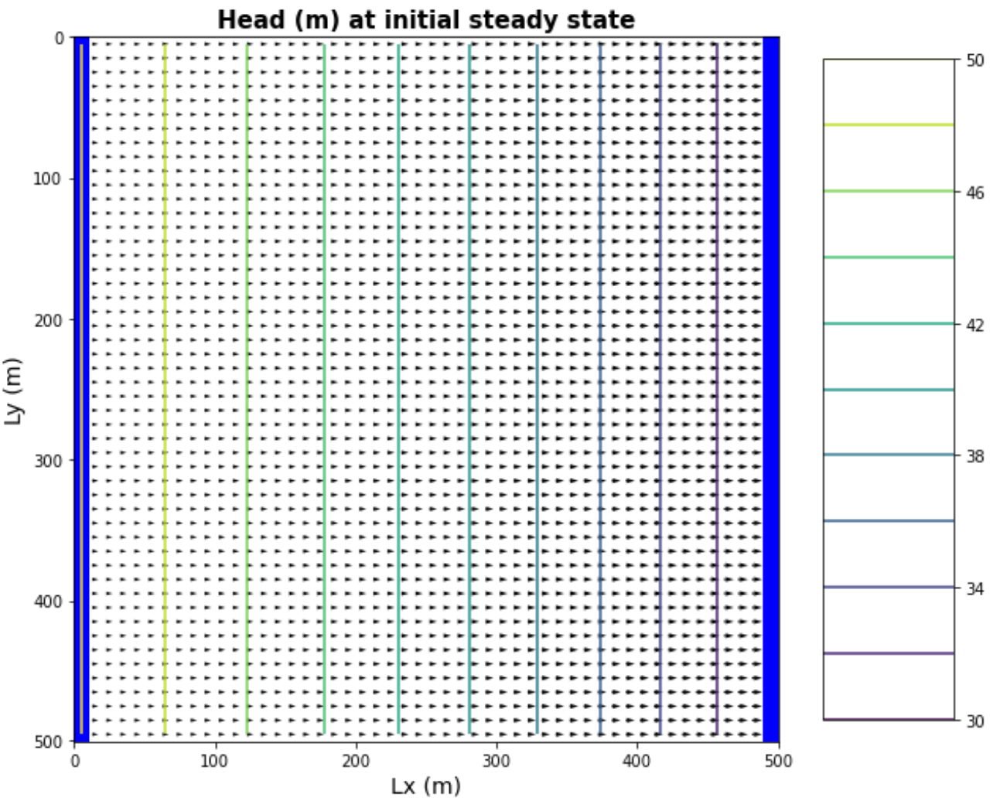
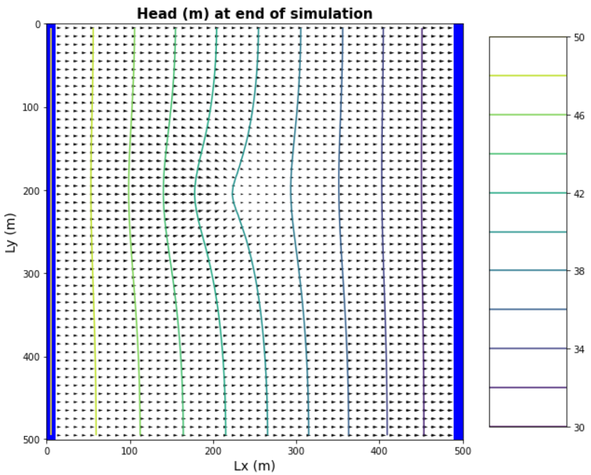

# HW 6 Transients

#### Dalia Portillo
#### 3/15/2021


## Model Description
​The model is set up for a homogeneous medium. The single-layer domain is 50x50 cells. The cells are 10 m in lateral extent and 50 m in vertical. There is a well located at [0,20,20] (layer, row, column). Recharge occurs at a rate of 5e-4 m/day across the domain. The left and right boundaries have constant heads of 50 and 30, respectively. The well is pumped cyclically. Water is withdrawn at 500 m3/day for 90 days and then it is turned off for 270 days. (Pretend that a year is 360 days long.) The simulation is set to run for 100 years.

## The Challenges
#### a) The gradient is not uniform for the initial steady state conditions - discuss the influences of recharge and the unconfined condition on this nonlinearity


I htink this has to do with what we discussed about the convertible cells in MODFLOW. Since the saturated thickness changes and the cells change from unsaturated to saturated, there is a non-linear relationship. We have the recharge affecting the water table depth and the overall mass balance changing in between stress periods. The saturated thickness b changes because the head changes due to the well drawing water and the recharge adding water. In turn the head changes in response to the b changing showing a change in transmissivity T. 

Why is the gradient not uniform??? Is it becasue the well only influences within the zone of influence and outside this zone the gradient is gradually changing?

#### b) Determine if the system has reached steady state - consider a point at the well and another at the center of the domain.

Steady state is achieved when there is no change in storage (mass balance) with time. Other things *can* be changing, but volumetric quantity of water into or out of the domain does not. Time is relative. In our simulation, the total time is 100 years which is comparably larger than 90 days of pumping and 270 days no pumping for ONE year. 

how do we know storage hasn't changed? storage is divergence of flux? Will have to try to calculate it at the well and about the center!

#### c) Find the zone of influence of the well defined in two ways: - Based on the drawdown from the initial steady state to the end of simulation time (end of final no-pumping stress period). - Based on the drawdown from the end of the last pump-on stress period to the end of simulation time.

<p float="left">
   
   
</p>

*figure 1 (left) drawdown from the initial steady state to the end of simulation time*

*figure 2 (right) drawdown from the end of the last pump-on stress period to the end of simulation time*

zone of influnce Mehtod 1 (figure 1): I think the zone of influence consists of drawdown contours very close the the well and are nearly perfectly cirular. Anything that is influenced by the boundaries (even the slightly distorted looking ellipses) are outside the zone.

zone of influnce Mehtod 2 (figure 2): The extent of the zone of influence is within the smallest change in drawdown, in other words the largest circle.


```python

```

<p float="left">
   
   
   
</p>

*figure 3 the initial steady state contour map with flow vectors*
    
*figure 4 the final pump-on period contour map with flow vectors*
    
*figure 5 the final pump-off period contour map with flow vectors*
    

#### d) How long does it take a point at the center of the domain to reach steady state? At that point, explain how you could divide the domain into a steady and transient part and solve each separately.

$  \Delta t = \large \frac {V_ {olume}}{Q} = \int \frac {dS}{q} $


Well we could treat the whole domain as steady state and have only a partial volume a little larger than the capture zone and just treat that as a small transient system within a steady state homogenous domain.


```python

```


*figure 6 Head distribution at the well and at the center of the system*

#### e) Find a constant pumping rate (same throughout the year) that matches the head time series at the middle of the domain.


```python
# pumping 500 m^3/d for 90 days for 100 years
# no pumping for 270 days for 100 years

--
```

#### f) Find a constant pumping rate (same throughout the year) that matches the head time series at the well, leaving only a regular, repeating seasonal residual. Are the two pumping rates the same?


```python
--
```

#### g) Discuss the sources of water captured by this well. If you're up for a challenge, calculate them for the final pump-on period!

Sources of water include: from storage, at the left boundary within the capture zone, and from recharge.

#### h) Discuss how you would define the capture zone of the well. How is it different than our definitions of capture zone so far in the course?

The capture zone is now only the area that that diverts flow regardless if the flow vector terminates in the well or not.


*figure 7 drawing capture zone of well from figure 4*
