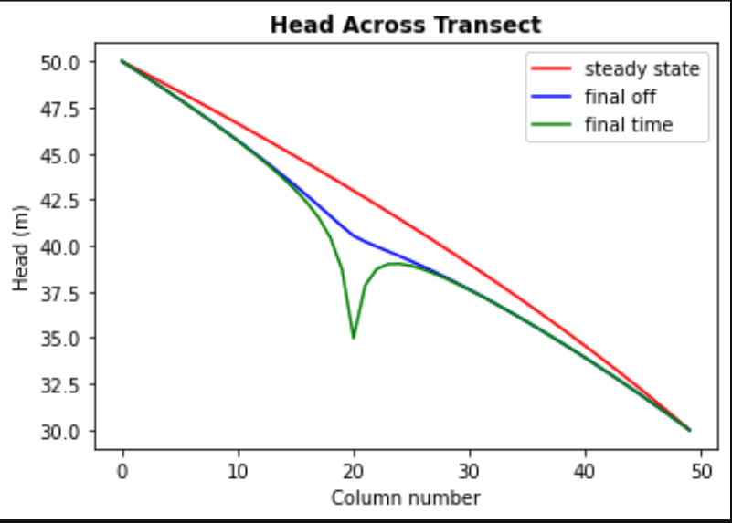
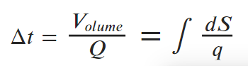

# HW 7 Transients

#### Dalia Portillo
#### 3/15/2021


## Model Description
​The model is set up for a homogeneous medium. The single-layer domain is 50x50 cells. The cells are 10 m in lateral extent and 50 m in vertical. There is a well located at [0,20,20] (layer, row, column). Recharge occurs at a rate of 5e-4 m/day across the domain. The left and right boundaries have constant heads of 50 and 30, respectively. The well is pumped cyclically. Water is withdrawn at 500 m3/day for 90 days and then it is turned off for 270 days. (Pretend that a year is 360 days long.) The simulation is set to run for 100 years.

## The Challenges
#### a) The gradient is not uniform for the initial steady state conditions - discuss the influences of recharge and the unconfined condition on this nonlinearity




*figure 1 Head distribution at the well and at the center of the system*

I think this has to do with what we discussed about the convertible cells in MODFLOW. Since the saturated thickness changes and the cells change from unsaturated to saturated, there is a non-linear relationship. We have the recharge affecting the head values and the overall mass balance changing in between stress periods. The saturated thickness b changes because the head changes due to the well drawing water and the recharge adding water. In turn the head changes in response to the b changing showing a change in transmissivity T. 

The head gradient is changing in response to the imbalnce in the inflow and outflow of the domain. The gradient is not linear due to the addition of recharge across the domain.

recharge creates unbalance accumulation of water or energy bc cells in the center of the domain recieve more water htna the boundary. near cells collaborate witha flow that alreayd has an extra input from recharge which means that the flow of one cell is the result of its recharge and the nearby recharge --> nonlinear. 

#### b) Determine if the system has reached steady state - consider a point at the well and another at the center of the domain.

Steady state is achieved when there is no change in storage (mass balance) with time. Other things *can* be changing, but volumetric quantity of water into or out of the domain does not. Time is relative. In our simulation, the total time is 100 years which is comparably larger than 90 days of pumping and 270 days no pumping for ONE year. 

In figure 2 below, we see that steady state can be estimated at about 50 years where there same changes occur at the well and over 60 years for the midpoint of the domain.


*figure 2 Head distribution at the well and at the center of the system*

#### c) Find the zone of influence of the well defined in two ways: 

- Based on the drawdown from the initial steady state to the end of simulation time (end of final no-pumping stress period). 
- Based on the drawdown from the end of the last pump-on stress period to the end of simulation time.

<center>
<p float="right">
   
    
   
</p>

*figure 3 (left) drawdown from the initial steady state to the end of simulation time*

*figure 4 (right) drawdown from the end of the last pump-on stress period to the end of simulation time*

Zone of influence Mehtod 1 (figure 1): I think the zone of influence consists of drawdown contours very close the the well and are nearly perfectly cirular. Anything that is influenced by the boundaries (even the slightly distorted looking ellipses) are outside the zone. This does not capture the true zone of influence since this considers only initial and final changes (an average of the change in drawdown). 

Zone of influnce Mehtod 2 (figure 2): This displays the 'recovery' period during the second stress period until the end of the 100th year. Figure 4 doesn't tell us whether the drawdown has been fully recovered by tells us the change in drawown from 91 days to 270 days of year 100. The Zone of Influence can be estiated to be within the largest circle/ring.


```python

```

#### d) How long does it take a point at the center of the domain to reach steady state? At that point, explain how you could divide the domain into a steady and transient part and solve each separately.

Well we could treat the whole domain as steady state and have only a partial volume a treated as a 
small transient system within a steady state homogenous domain. Below I try to draw how I would 
divide into two domains.

To separate the system, I use the flow lines as no flow boundaries and the head contours as constant head boundaries. The extent would be the 'capture zone' of the flow vectors that terminate in the well. Since this is a curvilinear shape, the volumetric flow is tricky, so I will create rigid rectangualr shape which is larger than the predicted capture zone.

I changed the flow vector plots to see the changes after each stress period each year. I figured the contour plots should look similar after about 40 years, but I found that the plots actually reached a visual similarity around 20 years, much sooner than I expected. But these plots liklely don't truly represent when steady state is reached since this shows the model response after each stress period. Thus we rely on the head distribution figures to estimate the time it takes to reach steady state.


*figure 3 headcontours with flow vectors at the end of each year*

#### e) Find a constant pumping rate (same throughout the year) that matches the head time series at the middle of the domain.

Q = KA dH/dL = KA grad(H)


```python
A = 50*50           # m^2
K = 1               # m/d
gradH = .0228574    # m/m

Q = K*A*gradH       #m^3/d
Q_yr = Q*(90/100)   #m^3/yr

print(str(Q)+ " m^3/d")
print(str(Q_yr)+ " m^3/yr")
```

    57.1435 m^3/d
    51.42915000000001 m^3/yr
    

This looks completely wrong. Flow shouldn't be this low per year. I thought an average of all the head values should provide a similar plot, but couldn't figure out how to plot it.

#### f) Find a constant pumping rate (same throughout the year) that matches the head time series at the well, leaving only a regular, repeating seasonal residual. Are the two pumping rates the same?


```python
# pumping 500 m^3/d for 90 days for 100 years
# no pumping for 270 days for 100 years

avg = ((500)*(90/100)+(0*270/100))/2
print ("an annual average pumping rate is " +str(avg)+ " m^3/yr")
```

    an annual average pumping rate is 225.0 m^3/yr
    

No the two pumping rates are not the same. This is expected because the average pumping rate over the year is not the same as the punping rate for 90 days only.

#### g) Discuss the sources of water captured by this well. If you're up for a challenge, calculate them for the final pump-on period!

Sources of water include: from storage, at the left boundary within the capture zone, and from recharge.

In class we discussed how the volume of water at the left inflow boundary is replaced by water from storage. Water captured by the well is not directly from storage since the well is off for 3/4 of the year. 

$  \Delta t*Q =  V_ {olume} $



#### h) Discuss how you would define the capture zone of the well. How is it different than our definitions of capture zone so far in the course?

The capture zone is now only the area that that diverts flow regardless if the flow vector terminates in the well or not.

The capture zone oscillates (compresses and contracts like a heart beat) in shape with each stress period. It grows with the well pumping and shrinks when the well is off. This means the zone is not definite and depends on time and whether the well is pumping.

<p float="center">
   
   
   
</p>

*figure 5 the initial steady state contour map with flow vectors*
    
*figure 6 the final pump-on period contour map with flow vectors*
    
*figure 7 the final pump-off period contour map with flow vectors*
    


```python

```
