# Layers and Particles

##### Dalia Portillo

Run the same transient model, only this time, run in the equivalent annual steady state pumping and add particles. Track the evolution of the capture zone after T = 25, 50, 75, 100 years of pumping. Also break the model into three layers.

### The Challenge

#### 1. How does the capture zone evolve in time? Where does the early time capture zone get its water?

   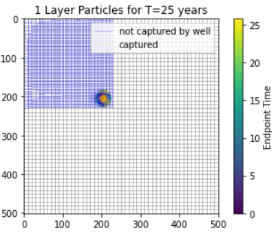
   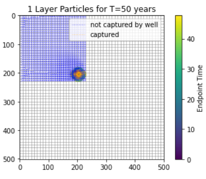
   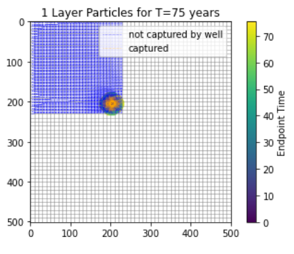

Above we can see the eovlution of the capture zone for a layer system starting from year = 0 to year = 75. The well is pumping at an average annual rate of 250 m/d. As time increases with the pump on (never turning off any point), we can see the size of the orange circle increase. these are particles captured by the well.  I believe this shows the extent of the capture zone within the domain. Adn its very small actually, only taking in particles from surrounding the well (~50m in diameter).

#### 2. Where does the 'infinite time' capture zone get its water?

In a previous class, Matt made an analogy about a breweing company. That is, as company X brewes craft beer, each previously distributed shipemtn gets replaced by the newly brewed beer. So in this case, volumes of water at the boundaries flow from high gradient to low gradient as usual. But the volumes of water are replaced by water from storage. ...I think. My model crashes if I run for over 200 years and I did not try anything between 100 and 200 years. But I think running a well for 100 years is RELATIVELY close to inifite!

   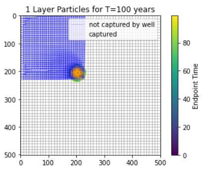

#### 3. How does the extent of the capture zone change when layers are considered? Can you still define a 2D capture zone??

   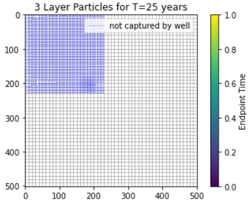
   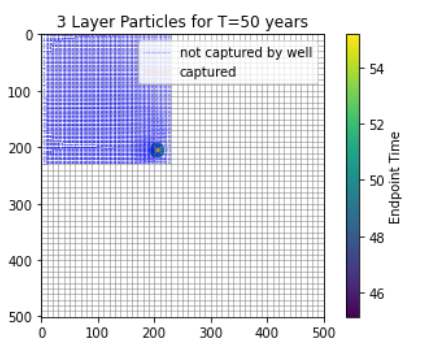
   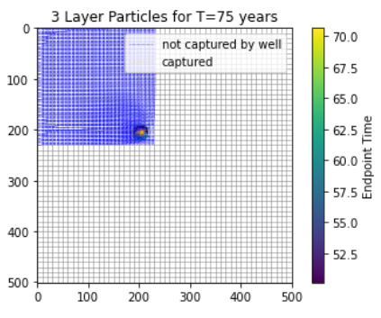

when layers are added, the extent of the capture zone is now 3D. We can define a 2D capture zone within each layer, but not as a whole.

Above are the time steps for the top layer and below are the middle and bottom layers. Ideealy, since the middle layer is supposed to act as confined we should see the greatest impact but I think I missed something in my code about the layer properties. So here we see the impacts of the well in thebottom layer and in the middle unit. At about 75 years, it looks as if the extent has now increased to approx ~ 50m radius around the well (~100m diameter).

   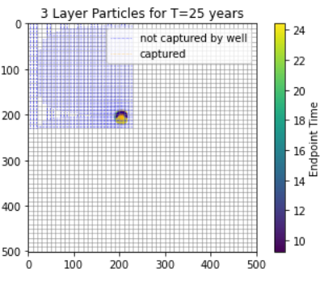
   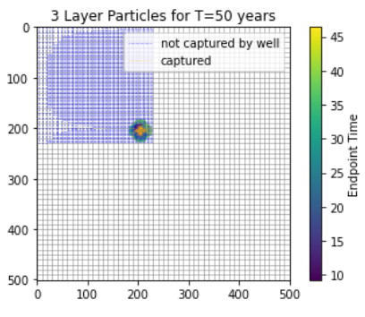
   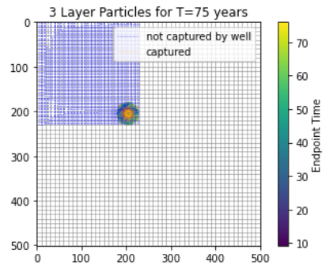

   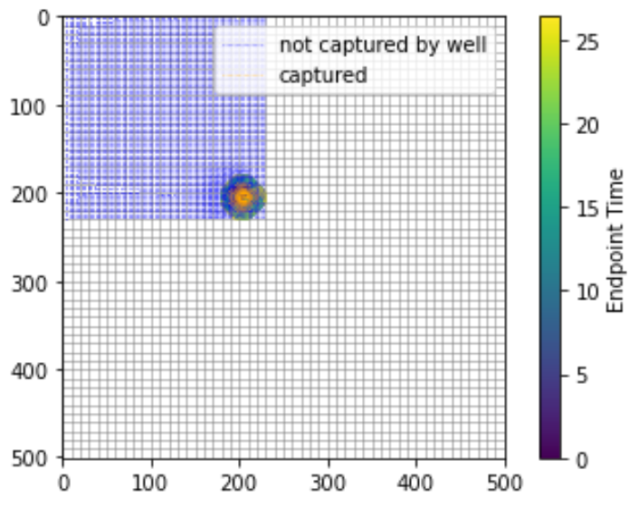
   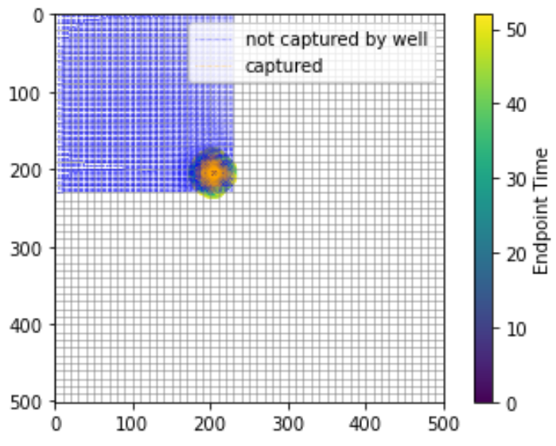
   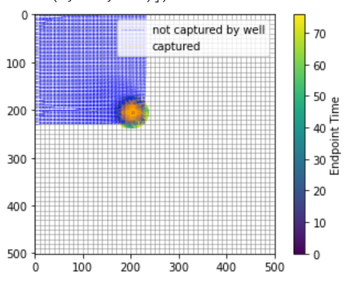

#### 4. How does the extent of the 'infinite time' capture zone change when layers are added? Explain any difference in the lateral extent of the capture zone along the left boundary.

   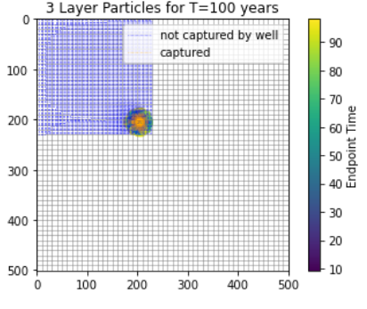
   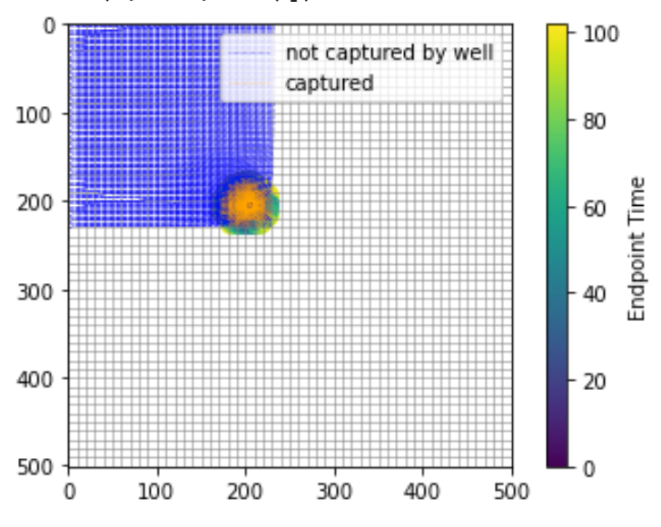

On the left is the top most layer and the right is the bottom layer for 100 years of pumping. Compared with the 75 years layer 3 above, we see the 100 years layer 3 is more or less the same size but the radial distance in layer 1 has now increased as seen on the left. In 3D, it would produce a conical shape....at least according to my code......

