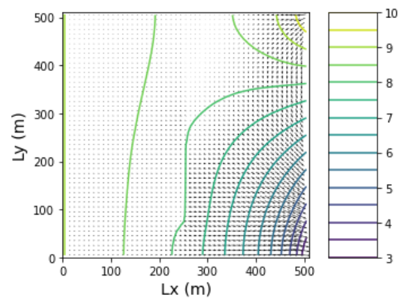
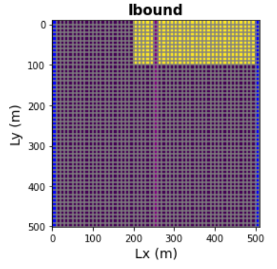
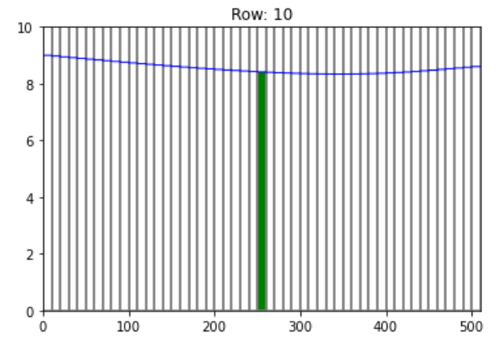
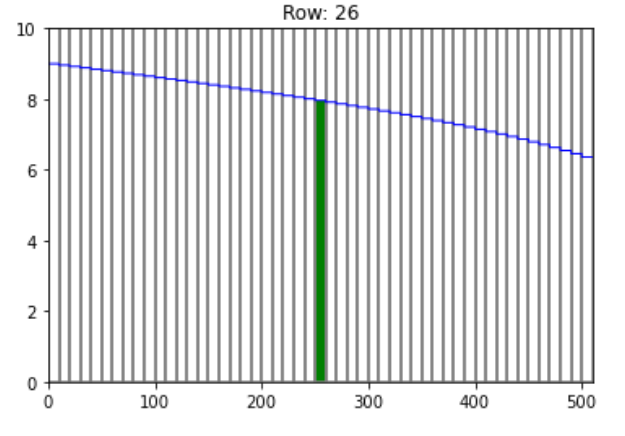
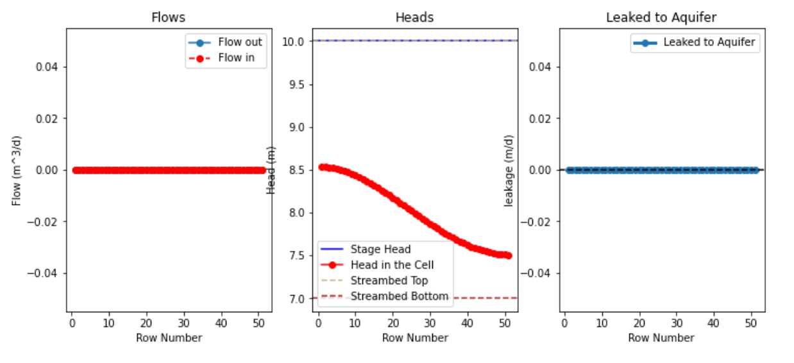
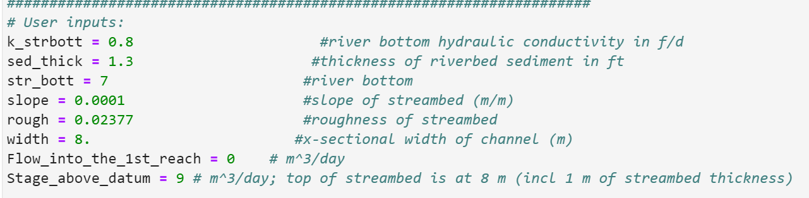
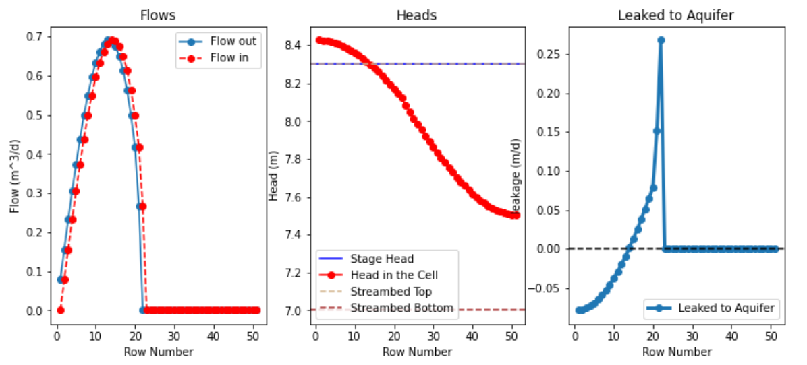
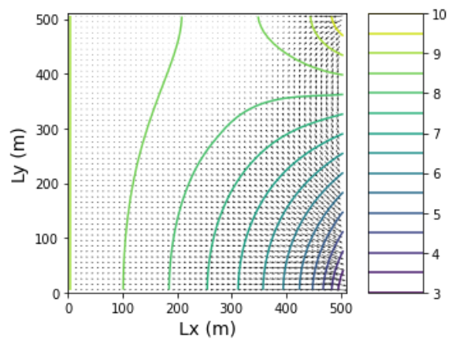
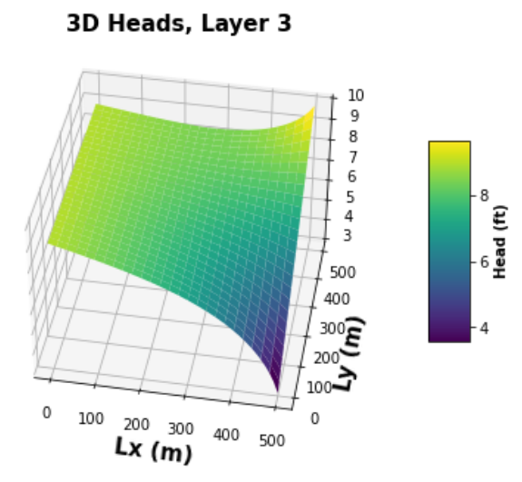

# Streams

#### Dalia Portillo

This flopy code simulates flow in a single layer model including a stream that runs along the center column. There is uniformly distributed recharge over part of the domain. There is no ET. The aquifer is unconfined. Let's explore stream-aquifer exchange.

### Model Description

​The model is set up for a homogeneous medium. However, the streambed conductivity changes within *three zones* along the stream. The single-layer domain is 51x51 cells. The cells are 10 m in lateral and vertical extent. Recharge occurs at a rate of 5e-5 m/day in the first 26 rows. The left and right boundaries have defined heads to represent a lake and a river, respectively.

### The Challenges

<b> a) Use these figures to describe the nature (direction/magnitude) of stream/aquifer exchange along the stream. In particular, explain why the leakage changes magnitude or direction where these values change.</b>


<p float="left">
   
   
</p>

This is give us some insight into what is going on between stream flow and the underlying aquifer below. There is a connection between the stream and aquifer in the middle reach, between rows 20 to ~40. This is where the leakeage to the aquifer is seen increasing in value exponentially. The leakage is influenced by the recharge which supplies additinal flow into the aquifer. The effects of recharge decrease down stream so around row 45, the leakage is zero.


<b> b) Use the head distribution to describe the movement of water across the boundaries and into/out of the stream. </b>

Using the same figures above, we can get a generl sense of the movement of water in this system. from the left to the stream (columns 0:25), we have flow into the stream. From the head distributions, we can see the water table is higher where the lake is located and decreases towrads the stream. Thus flow is from the constant head boundary at the lake to the stream in column 26. This is where the head values equal to the surface level stage height in the stream. While all flow is into the stream on the left of the domain, the right side tells another story. In the top 20 rows, we have flow into the stream most liekly influenced by the recharge in rows 0:26. Then around row 25 to the right of the stream, we have flow out of the stream and from recharge into the aquifer. Finally, downstream in rows beyond 43, we have a disconnect from the stream and aquifer where this water isn't directly from the stream. I'm still trying to figure this one out? Is it due to slope? or sediment thickness?


```python

```

<b> c) Choose two things to explore (e.g. impact of streambed K or inflow into the river or recharge rate). Produce a plot for each to compare to the base plots and use the plots to explain the impact of the hydrologic change. </b>

1. I changed the area over which recharge occurs from the top 26 rows to the a small corner in the right. This is simulate a system where rain ocurs in the northest part of the domain. I also reduced the sediment thickness of the stream and decreased the width of the stream from 20 to 8.
This results in NO CONNECTION between the stream and the aquifer. why? Well the river is now too high that flow is almost negligble across the bounds between stream and aquifer. Yet the head contours remain reltivley unchanged as shown by the crossection figures starting from row 10 to row 50.

<p float="left">
    
    
    
    
</p>

 


```python

```

2. Now I want to know what is the smallest value or combination of parameters that the stream needs to leak into the aquifer without recharge. there are more changes I can make to force a connection but, what I did was decrease the sediment thickness, the stream botom level, and the stream conductance.

Again the head contours doesn't really change dramatically. But this does illustrate that there is a small connectin which allows the water to leak into the aquifer across a small reach of the stream. This occurs around row 20 where we see flow nearly stop and the heads reach approximately 8.1 meters. Because the conductance is so low the flow rate is also very low and slowly moving into and out of the stream. 

<p float="left">
    
</p>  





```python

```
